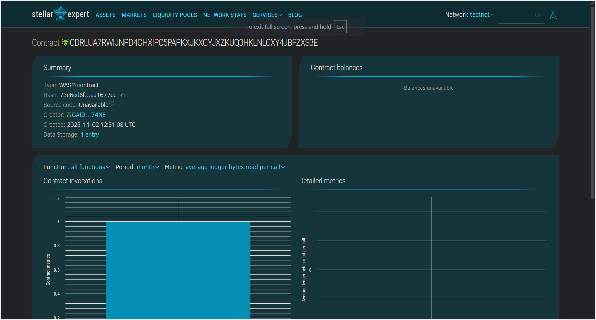

# Basic Token Swap Interface
## Contract Details
# Contract ID: CDRUJA7RWIJNPD4GHXIPC5PAPKXJKXGYJXZKUQ3HKLNLCXY4JBFZXS3E



## Project Title
**Basic Token Swap Interface - Decentralized Token Exchange on Stellar Soroban**

## Project Description
The Basic Token Swap Interface is a decentralized exchange (DEX) smart contract built on the Stellar blockchain using Soroban SDK. This project implements a simple yet powerful automated market maker (AMM) mechanism that enables users to seamlessly swap between two tokens in a trustless and transparent manner.

The smart contract utilizes the constant product formula (x * y = k) to determine exchange rates dynamically based on the liquidity pool reserves. This ensures fair pricing that automatically adjusts based on supply and demand, without requiring order books or centralized intermediaries.

Key functionalities include:
- **Pool Initialization**: Set up a liquidity pool with initial token reserves
- **Token A to Token B Swap**: Exchange Token A for Token B at the current market rate
- **Token B to Token A Swap**: Exchange Token B for Token A at the current market rate
- **Pool Status Monitoring**: View real-time liquidity pool reserves and swap statistics

## Project Vision
Our vision is to democratize access to decentralized finance (DeFi) by providing a simple, secure, and efficient token swapping mechanism on the Stellar network. We aim to:

1. **Eliminate Intermediaries**: Enable peer-to-contract trading without centralized exchanges
2. **Ensure Transparency**: All transactions and pricing mechanisms are fully auditable on-chain
3. **Promote Financial Inclusion**: Provide low-barrier entry to DeFi for users worldwide
4. **Build Trust**: Leverage blockchain immutability to create trustless financial infrastructure
5. **Foster Innovation**: Serve as a foundation for more complex DeFi applications and protocols

By leveraging Stellar's fast transaction speeds and low fees, combined with Soroban's smart contract capabilities, we're creating an accessible entry point into decentralized trading for both newcomers and experienced DeFi users.

## Key Features

### 1. **Automated Market Maker (AMM) Logic**
- Implements the constant product formula (x * y = k) for automated price discovery
- No need for order books or manual market making
- Prices adjust automatically based on trade size and pool liquidity

### 2. **Liquidity Pool Management**
- Initialize pools with custom token pair reserves
- Track real-time reserve balances for both tokens
- Monitor total number of swaps executed through the pool

### 3. **Bidirectional Token Swaps**
- Swap Token A for Token B with instant execution
- Swap Token B for Token A with instant execution
- Fair pricing based on current pool reserves

### 4. **Transparent On-Chain Operations**
- All transactions recorded on the Stellar blockchain
- Full audit trail of swaps and reserve changes
- Real-time pool statistics accessible to all users

### 5. **Security Features**
- Input validation to prevent invalid transactions
- Pool initialization protection to prevent overwriting
- Panic handling for edge cases and error conditions

### 6. **Gas Efficient Design**
- Optimized storage using Soroban's efficient data structures
- Minimal computational overhead for swap calculations
- Extended TTL (Time To Live) for persistent data storage

## Future Scope

### Phase 1: Enhanced Functionality
- **Multi-Token Support**: Expand beyond token pairs to support multiple token pools
- **Liquidity Provider Rewards**: Implement LP tokens and fee distribution mechanisms
- **Slippage Protection**: Add minimum output amount parameters to protect users from price impact
- **Fee Structure**: Introduce configurable swap fees to incentivize liquidity providers

### Phase 2: Advanced AMM Features
- **Multiple Pool Types**: Support different AMM curves (stable swap, weighted pools)
- **Price Oracle Integration**: Connect external price feeds for better arbitrage protection
- **Flash Swap Support**: Enable flash loans for advanced trading strategies
- **Concentrated Liquidity**: Allow liquidity providers to focus capital in specific price ranges

### Phase 3: User Experience Enhancements
- **Frontend Interface**: Develop a user-friendly web application for easy interaction
- **Mobile App Integration**: Create mobile apps for on-the-go trading
- **Price Charts**: Real-time visualization of token prices and trading volumes
- **Transaction History**: Detailed user trading history and analytics

### Phase 4: Ecosystem Integration
- **Cross-Chain Bridges**: Enable token swaps across different blockchain networks
- **Yield Farming**: Allow users to stake LP tokens for additional rewards
- **Governance Token**: Implement DAO governance for protocol upgrades and decisions
- **API Access**: Provide developer APIs for third-party integrations

### Phase 5: Enterprise & Scalability
- **Institutional Features**: Add advanced tools for large-volume traders
- **Compliance Module**: Integrate KYC/AML features for regulated markets
- **Performance Optimization**: Enhance scalability for high-frequency trading
- **Security Audits**: Regular third-party security audits and bug bounty programs

---

## Getting Started

### Prerequisites
- Rust programming language
- Soroban CLI tools
- Stellar account for testnet/mainnet deployment

### Installation
```bash
# Clone the repository
git clone <repository-url>

# Navigate to project directory
cd Basic-Token-Swap-Interface

# Build the contract
stellar contract build

# Optimize the contract (optional)
stellar contract optimize --wasm target/wasm32-unknown-unknown/release/hello_world.wasm
```

### Deployment
```bash
# Deploy to Stellar testnet
stellar contract deploy \
  --wasm target/wasm32-unknown-unknown/release/hello_world.wasm \
  --source <your-secret-key> \
  --network testnet

# Install contract
stellar contract install \
  --wasm target/wasm32-unknown-unknown/release/hello_world.wasm \
  --source <your-secret-key> \
  --network testnet
```

### Usage Example
```bash
# Initialize the pool with 1,000,000 of each token
stellar contract invoke \
  --id <contract-id> \
  --source <your-secret-key> \
  --network testnet \
  -- initialize_pool \
  --token_a_amount 1000000 \
  --token_b_amount 1000000

# Swap 1000 Token A for Token B
stellar contract invoke \
  --id <contract-id> \
  --source <your-secret-key> \
  --network testnet \
  -- swap_a_for_b \
  --amount_a_in 1000

# View pool status
stellar contract invoke \
  --id <contract-id> \
  --source <your-secret-key> \
  --network testnet \
  -- view_pool
```

## Smart Contract Functions

### `initialize_pool(token_a_amount: i128, token_b_amount: i128)`
Initializes the liquidity pool with starting reserves for both tokens.
- **Parameters**: 
  - `token_a_amount`: Initial reserve amount for Token A
  - `token_b_amount`: Initial reserve amount for Token B
- **Returns**: None
- **Note**: Can only be called once per contract instance

### `swap_a_for_b(amount_a_in: i128) -> i128`
Swaps Token A for Token B using the AMM formula.
- **Parameters**: 
  - `amount_a_in`: Amount of Token A to swap
- **Returns**: Amount of Token B received
- **Formula**: `amount_b_out = (amount_a_in * reserve_b) / (reserve_a + amount_a_in)`

### `swap_b_for_a(amount_b_in: i128) -> i128`
Swaps Token B for Token A using the AMM formula.
- **Parameters**: 
  - `amount_b_in`: Amount of Token B to swap
- **Returns**: Amount of Token A received
- **Formula**: `amount_a_out = (amount_b_in * reserve_a) / (reserve_b + amount_b_in)`

### `view_pool() -> LiquidityPool`
Returns the current state of the liquidity pool.
- **Returns**: LiquidityPool struct containing:
  - `token_a_reserve`: Current reserve of Token A
  - `token_b_reserve`: Current reserve of Token B
  - `total_swaps`: Total number of swaps executed

## Testing

```bash
# Run all tests
cargo test

# Run tests with output
cargo test -- --nocapture
```

## Project Structure
```
Basic-Token-Swap-Interface/
├── README.md
├── Cargo.toml
├── contracts/
│   └── hello-world/
│       ├── Cargo.toml
│       └── src/
│           └── lib.rs          # Main smart contract code
└── target/                     # Build output directory
```

## Contributing
We welcome contributions from the community! Here's how you can help:

1. Fork the repository
2. Create a feature branch (`git checkout -b feature/AmazingFeature`)
3. Commit your changes (`git commit -m 'Add some AmazingFeature'`)
4. Push to the branch (`git push origin feature/AmazingFeature`)
5. Open a Pull Request

Please ensure your code follows the existing style and includes appropriate tests.

## Security Considerations
- This is a basic implementation for educational purposes
- Always conduct thorough security audits before deploying to mainnet
- Consider adding additional safety checks for production use
- Implement proper access controls for admin functions
- Add comprehensive error handling and input validation


## Acknowledgments
- Built with Soroban SDK
- Inspired by Uniswap V2 AMM model
- Thanks to the Soroban community


---

**Built with ❤️ on Stellar Soroban**